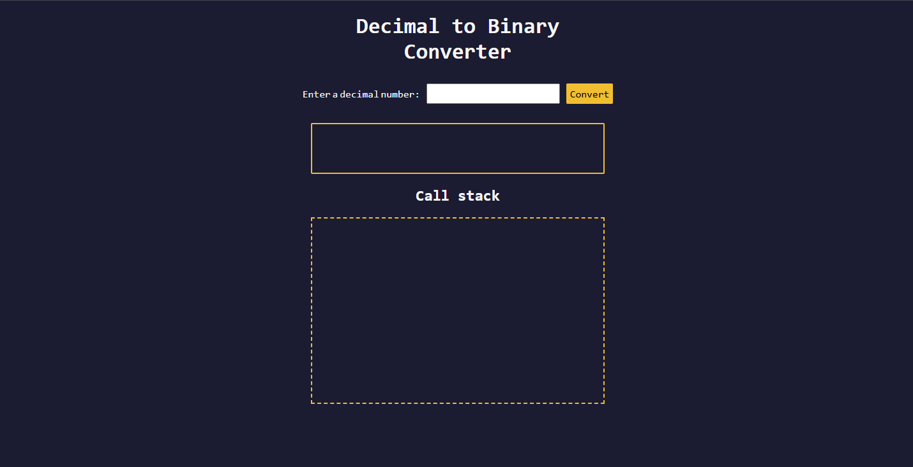

# Decimal to Binary Converter

A responsive web application that converts non-negative decimal numbers into their binary representation.

Includes an optional call stack animation to visually demonstrate how recursion executes step-by-step.

## Live Demo
https://sharpsanders.github.io/decimal-to-binary-converter/



---

## Features

- Converts any non-negative integer to binary
- Handles invalid input (empty, non-numeric, negative)
- Submit via button click or Enter key
- Recursive conversion algorithm
- Optional call stack animation (demonstrates recursion flow)
- Responsive layout using modern CSS (`clamp`, flexbox, media queries)

---

## Tech Stack

- HTML5
- CSS3
- JavaScript (ES6+)

No frameworks or external libraries.

---

## Concepts Demonstrated

- Recursive function design
- Base case vs recursive case handling
- Using `Math.floor()` and modulo operations
- DOM manipulation and dynamic updates
- Timed UI updates using `setTimeout`
- Input validation and event handling

---

## How It Works

### Conversion Algorithm

The core function uses recursion:

```js
function decimalToBinary(input) {
  if (input === 0 || input === 1) {
    return String(input);
  }
  return decimalToBinary(Math.floor(input / 2)) + (input % 2);
}
Base case: returns "0" or "1".

Recursive case: calls itself with Math.floor(input / 2) and appends the remainder.

This builds the binary string from most significant bit to least.

Call Stack Animation
When a specific input (e.g., 5) is entered:

The app visually simulates recursive calls.

Frames are added to the DOM.

Each frame explains what the function is returning.

Frames are removed as they “pop” off the call stack.

Final result is displayed after the animation completes.

This provides a simplified visualization of recursion execution.

Project Structure
decimal-to-binary-converter/
├── index.html
├── styles.css
└── script.js
What I Practiced
Writing and reasoning through recursive functions

Visualizing call stack behavior

Managing asynchronous UI updates with setTimeout

Validating and sanitizing user input

Building a self-contained interactive utility

Future Improvements
Show call stack animation for any valid input

Add conversion history

Support negative numbers (two’s complement)

Add unit tests for conversion logic

UI toggle for themes

Built by Trevyn Sanders
GitHub: https://github.com/SharpSanders